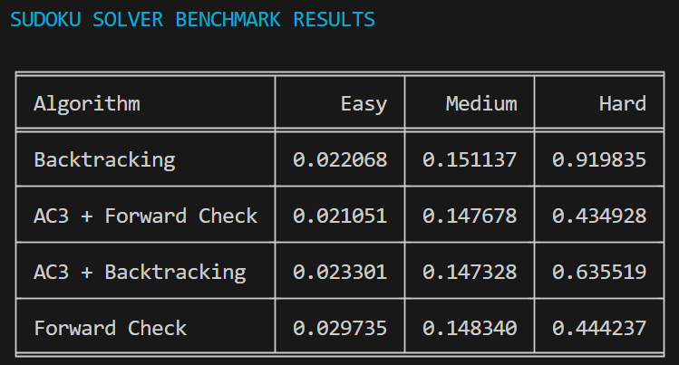
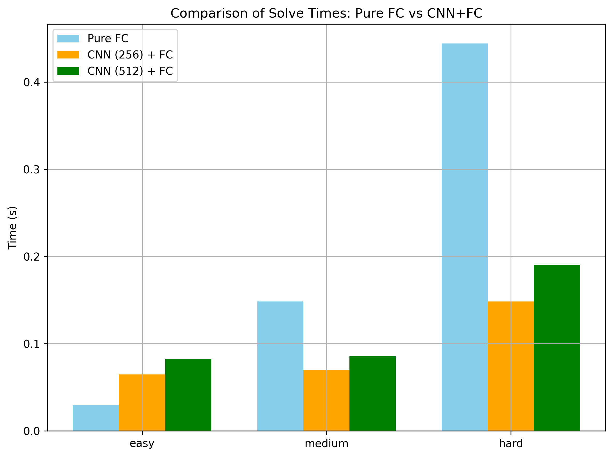

# Sudoku solver

This project explores how different algorithms solve Sudoku: from classic backtracking, to smarter constraint satisfaction techniques (MRV, Forward Checking, AC-3), and finally a hybrid solver that uses a Convolutional Neural Network (CNN) to guide the search.

## Dataset

To ensure consistent difficulty levels across our experiments, we relied on a dataset that specifies the number of clues in every Sudoku puzzle. Using this metadata, we constructed three benchmark sets by sampling 100 puzzles each from the 41-clue, 31-clue, and 24-clue categories, corresponding to easy, medium, and hard. All chosen puzzles are included in the `puzzles/` directory.

The Sudoku puzzles in the `puzzles/` directory are sourced from:
[4 Million Sudoku Puzzles Easy-to-Hard](https://www.kaggle.com/datasets/informoney/4-million-sudoku-puzzles-easytohard) licensed under CC BY-NC-SA 4.0.

## Algorithms

In this section, we describe the classical Sudoku-solving techniques we implemented, progressing from the simplest brute-force approach to more sophisticated constraint-based methods.

### Backtracking

Backtracking serves as the baseline solver. It explores the search space using depth-first search:

1. Find the next empty cell.
2. Try digits 1–9 in order.
3. For each digit, check whether the placement is valid.
4. Recurse; if the branch leads to a dead end, undo the move and continue.

Backtracking always finds a solution if one exists, but its performance degrades heavily on harder puzzles because it explores many unnecessary branches.

---

### MRV + Forward Checking

To improve the basic solver, we added two key ideas from constraint satisfaction problems (CSPs):

**Minimum Remaining Values (MRV)**  
Instead of picking the first empty cell, we select the cell with the smallest domain (i.e., the fewest valid digits). This focuses the search on the most constrained parts of the puzzle first.

**Forward Checking**  
Whenever we assign a value to a cell, we immediately remove that value from the domains of all its peers (same row, column, or box).  
If any peer domain becomes empty, we know the current assignment cannot lead to a solution, so we backtrack early.

Together, these techniques dramatically reduce the search tree, especially for medium and hard puzzles.

---

### AC-3 (Arc Consistency)

AC-3 is a constraint-propagation algorithm that enforces local consistency before (and optionally during) the search:

1. Represent each Sudoku cell as a variable with a domain of possible digits.
2. Build arcs between variables that constrain each other (row/column/box relationships).
3. Repeatedly prune domains: if a value in one cell has no supporting value in a neighbor cell, remove it.
4. Apply forced assignments when a domain collapses to a single value.

AC-3 often solves large portions of the puzzle without search at all.  
When combined with backtracking or forward checking, it reduces the number of guesses needed.

---

### Benchmark

Below is the performance comparison of the classical algorithms across the easy/medium/hard puzzle sets:

We see the real difference between these algorithms when solving hard puzzles

## Introducing CNN

After evaluating our constraint-based solvers, we introduced a learning-based component: a Convolutional Neural Network trained to predict the most likely digit for every empty cell in a Sudoku grid. Unlike our previous approaches, which are fully deterministic, the CNN provides a data-driven heuristic that helps the solver prioritize promising moves.

---

### Model Architecture

The CNN takes the Sudoku grid encoded as integers from 1-9, normalized to `[-0.5, 0.5]`.  
We trained two versions of the same architecture:

- **256-filter model**
- **512-filter model**

Both models share the same structure:

- Input: **9×9×1**
- **10 convolutional layers**, each with 512 filters, kernel size 3×3, padding `"same"`
- Batch normalization + ReLU after every layer
- Final **1×1 convolution** with 9 filters and **softmax**, producing a distribution over digits 1–9 for every cell
- Optimizer: Adam (1e-4), loss: categorical cross-entropy

---

### How We Integrate the CNN Into the Solver

The CNN is **not** used to fill the board directly. 
Instead, we use it to **prioritize which values to try first** during forward checking:

1. We run the CNN once on the puzzle to obtain a **ranked list** of digits for every empty cell.
2. When the solver selects the next cell using MRV, it looks up the CNN’s ranking for that specific cell.
3. Forward checking then proceeds as usual, but it tries the values in the order suggested by the CNN instead of numerical order.

This keeps the solver fully constraint-driven while giving it a learned heuristic that reduces unnecessary backtracking.

---

### Benchmark Results: Forward Checking vs CNN-Guided Forward Checking

Below is the visual comparison of:

- **Pure Forward Checking**
- **CNN-256 + FC**
- **CNN-512 + FC**

The benchmark highlights a clear trend: pure forward checking slows down rapidly as puzzle difficulty increases, jumping from roughly 0.03 seconds on easy puzzles to over 0.45 seconds on hard ones. In contrast, both CNN-guided variants keep solve times much more stable across all difficulty levels. The 256-filter model is especially effective, reducing the average solve time on hard puzzles from about 0.45 seconds to around 0.15 seconds - a roughly **3× speedup**. The 512-filter model carries a slightly higher inference cost but still cuts the hard-puzzle runtime by more than half, demonstrating that learned digit priorities significantly reduce the amount of backtracking required.

## Conclusion

Across all our experiments, each solver enhancement consistently reduced the search space and improved runtime, with the most significant gains appearing on medium and hard puzzles. Classical constraint-based improvements like MRV, forward checking, and AC-3 already made the solver far more efficient than naive backtracking, but adding CNN-guided value ordering provided an additional boost - especially on difficult boards where search heuristics matter most. The 256-filter CNN in particular achieved around a 3× speedup on hard puzzles compared to pure forward checking, showing that even a single learned inference can meaningfully guide the solver toward better decisions.
Overall, combining deterministic constraint reasoning with a lightweight learned heuristic resulted in a solver that is both reliable and noticeably faster, especially in cases where traditional methods tend to struggle.
